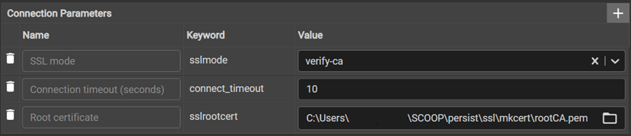
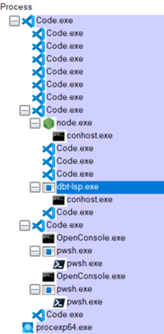

# Databases

## BigQuery

BigQuery can be used in Dbt Fusion and Dbt-core.

[Specific BigQuery](https://docs.getdbt.com/reference/resource-configs/bigquery-configs)

## PostgreSQL

PostgreSQL can only be used in Dbt-core.

[Specific PostgreSQL](https://docs.getdbt.com/reference/resource-configs/postgres-configs)

### in Podman

Cf [dbt-podman](https://github.com/mgn-dbt/dbt-podman)

### in SCOOP

For PostgreSQL in SCOOP, Dbt-core can be installed in a python venv.  
Cf [Environment](./Environment.md)

Start instance :

```cmd
pg_ctl.exe start
```

Connect as DBA :

```cmd
chcp 1252
psql.exe -U postgres
```

#### Create roles and database

```sql
set password_encryption = 'scram-sha-256';

CREATE ROLE jaffle WITH
LOGIN
NOSUPERUSER
INHERIT
NOCREATEDB
NOCREATEROLE
NOREPLICATION
NOBYPASSRLS
ENCRYPTED PASSWORD 'xxxxxxxxxxxx';

CREATE ROLE lecteur WITH
LOGIN
NOSUPERUSER
INHERIT
NOCREATEDB
NOCREATEROLE
NOREPLICATION
NOBYPASSRLS
ENCRYPTED PASSWORD 'xxxxxxxxxxxx';

CREATE DATABASE jaffle_shop
WITH
OWNER = postgres
ENCODING = 'UTF8'
LOCALE_PROVIDER = 'libc'
CONNECTION LIMIT = -1
IS_TEMPLATE = False;

GRANT CONNECT ON DATABASE jaffle_shop TO lecteur;

GRANT  ALL ON DATABASE jaffle_shop TO jaffle;

REVOKE ALL ON DATABASE jaffle_shop FROM public;
```

Before exiting psql, secure the postgres (DBA) account

```sql
ALTER USER postgres PASSWORD 'xxxxxxxxxxxx';
```

\q to exit psql

PostgreSQL connection should be established under SSL/TLS for security.

Cf [mkcert](https://github.com/filosottile/mkcert)

```cmd
$env:CAROOT='C:\Users\<username>\SCOOP\persist\ssl\mkcert'
mkcert -install
mkcert -cert-file (Join-Path $(mkcert -CAROOT) "server.cert.pem") -key-file (Join-Path $(mkcert -CAROOT) "server.key.pem") localhost $(hostname).ToLower()
```

#### postgresql.conf and pg_hba.conf

Add this at the end of postgresql.conf

```conf
include_if_exists = 'instance.conf'
```

Add this in instance.conf in the same directory as postgresql.conf :

```conf
listen_addresses = '*'
password_encryption = scram-sha-256
ssl=on
ssl_min_protocol_version = 'TLSv1.2'
ssl_ca_file = 'C:\\Users\\<username>\\SCOOP\\persist\\ssl\\mkcert\\rootCA.pem'
ssl_cert_file = 'C:\\Users\\<username>\\SCOOP\\persist\\ssl\\mkcert\\server.cert.pem'
ssl_key_file = 'C:\\Users\\<username>\\SCOOP\\persist\\ssl\\mkcert\\server.key.pem'
```

Backup original pg_hba.conf.  
Overwrite pg_hba.conf with :

```conf
# TYPE      DATABASE        USER            ADDRESS                 METHOD
hostssl     all             all             0.0.0.0/0               scram-sha-256
hostssl     all             all             ::/0                    scram-sha-256
hostnossl   all             all             0.0.0.0/0               reject
hostnossl   all             all             ::/0                    reject
```

Restart instance

```cmd
pg_ctl.exe restart
```

#### pgadmin 4

Solve embeded python certificate error

```powershell
& "<path_to>\postgresql\18.3\pgAdmin 4\python\python.exe" -m pip install pip_system_certs
```

Test SSL/TLS connection with pgadmin 4



## Duckdb

Duckdb can only be used in Dbt-core.

[Specific Duckdb](https://docs.getdbt.com/reference/resource-configs/duckdb-configs)

For Duckdb in SCOOP, Dbt-core can be installed in a python venv.  
Cf [Environment](./Environment.md)

Don't try using vscode with Duckdb.  
The Duckdb database is locked by the process connected to it.  
Only one process can read the database so vscode dbt extension lock it with the Language Server.  
There is no workaround.



Use Duckdb interactive shell.  
It opens duckdb ui in parallel with a command line to launch dbt commands.  

### Duckdb interactive shell

Cf [interactive shell](https://github.com/duckdb/dbt-duckdb/tree/master#interactive-shell)

In python sqlfluff venv and in duckdb git branch :  
python -m dbt.adapters.duckdb.cli --profile duckdb

```cmd
duckdbt (jaffle_shop_duck)> deps
07:49:42  Running with dbt=1.10.20
07:49:44  Installing dbt-labs/dbt_utils
07:49:46  Installed from version 1.3.3
07:49:46  Up to date!
07:49:46  Installing dbt-labs/audit_helper
07:49:47  Installed from version 0.13.0
07:49:47  Up to date!
07:49:47  Installing godatadriven/dbt_date
07:49:47  Installed from version 0.17.2
07:49:47  Up to date!
07:49:47  Installing metaplane/dbt_expectations
07:49:50  Installed from version 0.10.10
07:49:50  Up to date!
07:49:50  Installing https://github.com/tnightengale/dbt-meta-testing.git
07:49:54  Installed from revision b05df7ae6158a63e0ec966550c4217e20067f2f7

duckdbt (jaffle_shop_duck)> parse
07:49:58  Running with dbt=1.10.20
07:49:58  Registered adapter: duckdb=1.10.1
07:49:59  Unable to do partial parsing because saved manifest not found. Starting full parse.
07:50:02  Performance info: C:\Users\<username>\SCOOP\persist\_dev_\dbt\jaffle_shop_duck\target\perf_info.json

duckdbt (jaffle_shop_duck)> help

Documented commands (type help <topic>):
========================================
EOF    compile  deps  help  parse  run   snapshot
build  debug    exit  list  quit   seed  test
```

### Duckdb ui

From the projet root directory

```cmd
duckdb.exe -ui
```

```sql
attach '.\offline\tuto.duckdb' as tuto;
use tuto;

SELECT * FROM duckdb_settings();

detach tuto;
```

Don't forget to detach from database before exiting.

.exit (to quit)

#### Export notebook

```sql
copy (
  select
    "json"
  from _duckdb_ui.notebook_versions
  where 1=1
    and title = 'MyNotebook'
    and expires is null
) to 'exported-notebook.json';
```
