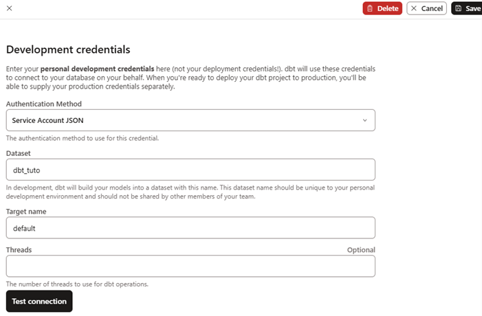

# The Jaffle Shop 🥪

Seeds to initialize the source tables for the Jaffle Shop tutorials

There are 2 batches of tables used in DBT tutorials.  
3 tables tuto : raw_customers, raw_orders and raw_payments  
6 tables tuto : customers, items, orders, products, stores and supplies

This project is for loading Jaffle data quickly into BigQuery, PostgreSQL or DuckDB.

Cf [Databases](./Databases.md)

Cf [Environment](./Environement.md)

## DBT Profiles

Set environment variables.
Cf [environment](./Environment.md#environment-variables)

Cf [env_var](https://docs.getdbt.com/reference/dbt-jinja-functions/env_var)

Content of `$env:USERPROFILE\.dbt\profiles.yml`

```yaml
default:
  target: dev
  outputs:
    dev:
      type: bigquery
      threads: 4
      project: "{{ env_var('DBT_BIGQUERY_PROJECT') }}"
      dataset: dbt_tuto
      method: service-account
      keyfile: "{{ env_var('DBT_BIGQUERY_KEYFILE') }}"
      location: US
    prod:
      type: bigquery
      threads: 4
      project: "{{ env_var('DBT_BIGQUERY_PROJECT') }}"
      dataset: dbt_prod
      method: service-account
      keyfile: "{{ env_var('DBT_BIGQUERY_KEYFILE') }}"
      location: US
pg:
  target: dev
  outputs:
    dev:
      dbname: jaffle_shop
      host: localhost
      password: jaffle
      port: 5432
      schema: dbt_tuto
      search_path: dbt_tuto,public
      threads: 1
      type: postgres
      user: jaffle
      sslmode: verify-ca
      sslrootcert: "{{ env_var('DBT_PG_ROOT_CERT') }}"
    prod:
      dbname: jaffle_shop
      host: localhost
      password: jaffle
      port: 5432
      schema: dbt_prod
      search_path: dbt_prod,public
      threads: 2
      type: postgres
      user: jaffle
      sslmode: verify-ca
      sslrootcert: "{{ env_var('DBT_PG_ROOT_CERT') }}"
duckdb:
  target: dev
  outputs:
    dev:
      type: duckdb
      path: "{{ env_var('DBT_DUCKDB_DATABASE') }}"
      schema: dbt_tuto
      threads: 4
      # threads: 1  (for log_query_path to work)
      #settings:
      #  log_query_path: '.\offline\duck_tuto_query.log'   You can use a relative path (relative to your profiles.yml file)
    prod:
      type: duckdb
      path: "{{ env_var('DBT_DUCKDB_DATABASE') }}"
      schema: dbt_prod
      threads: 4 
      # threads: 1  (for log_query_path to work)
      #settings:
      #  log_query_path: '.\offline\duck_tuto_query.log'   You can use a relative path (relative to your profiles.yml file)
```

Dbt Cloud BigQuery connection



BigQuery profile must be named "default" for Dbt Cloud.  
Cf Dbt Cloud BigQuery connection above.

Duckdb log_query_path is optional. Use it only to debug queries.  
Beware threads must be set to 1 if log_query_path is used.

NB : duckdb database path must be absolute to share the database between dbt projects

## Exec

dbt build --profile default     (for BigQuery with dbt fusion or dbt cloud)  
dbt build --profile pg          (for PostgreSql with dbt core)  
dbt build --profile duckdb      (for Duckdb with dbt core)
